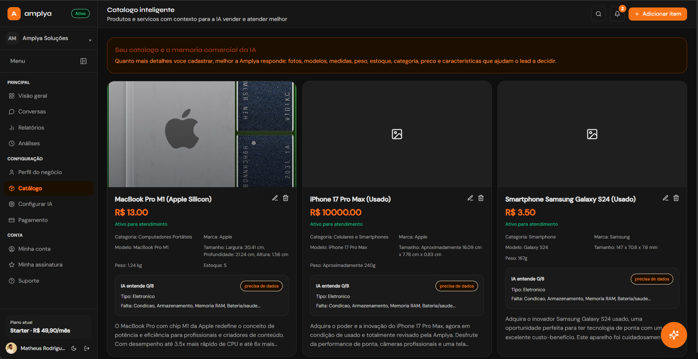
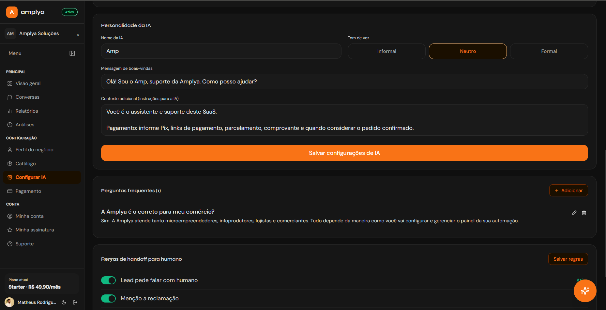
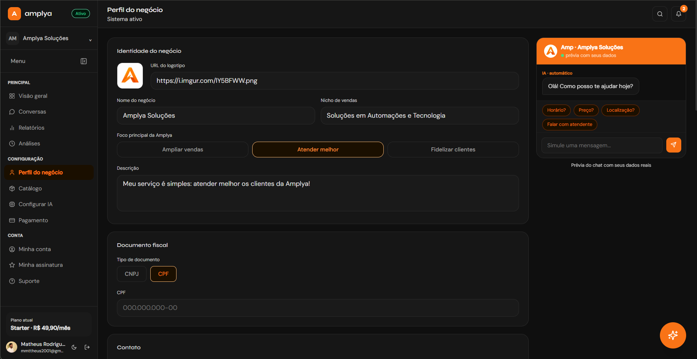
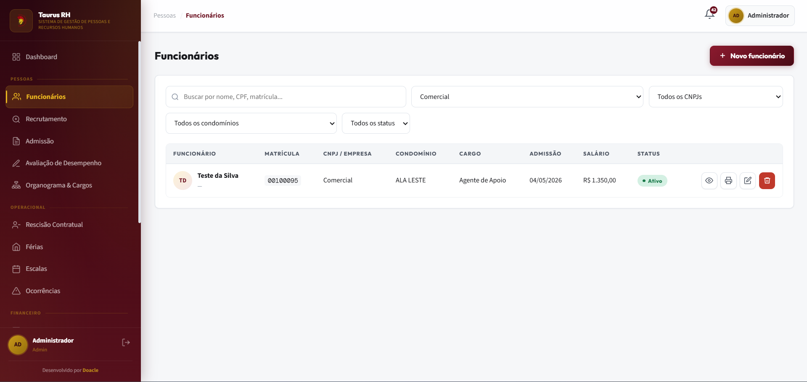
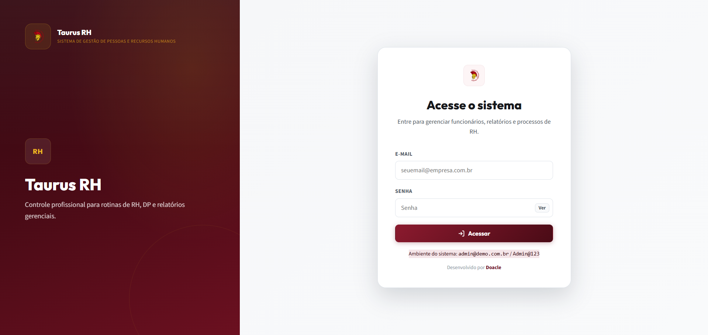
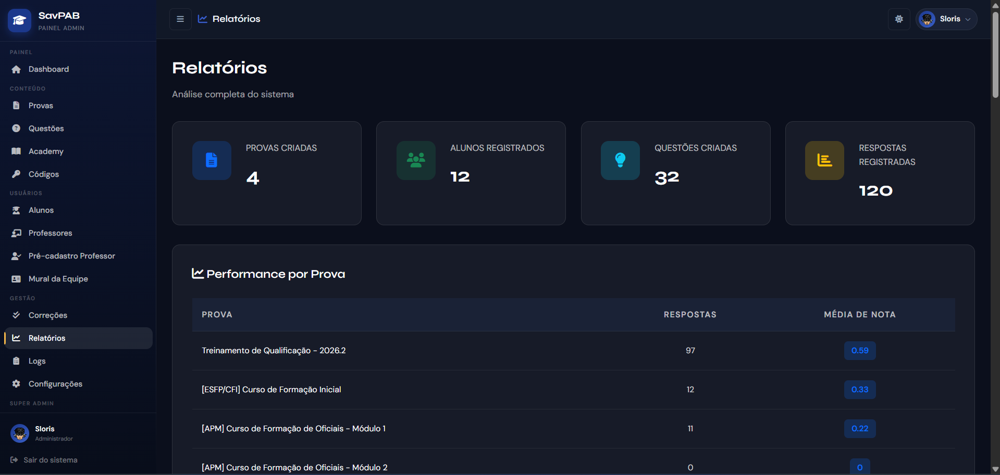
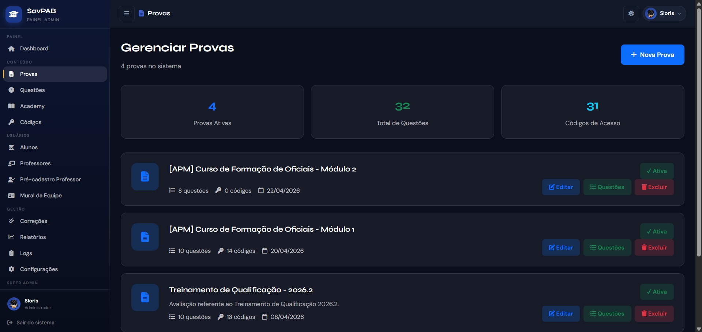
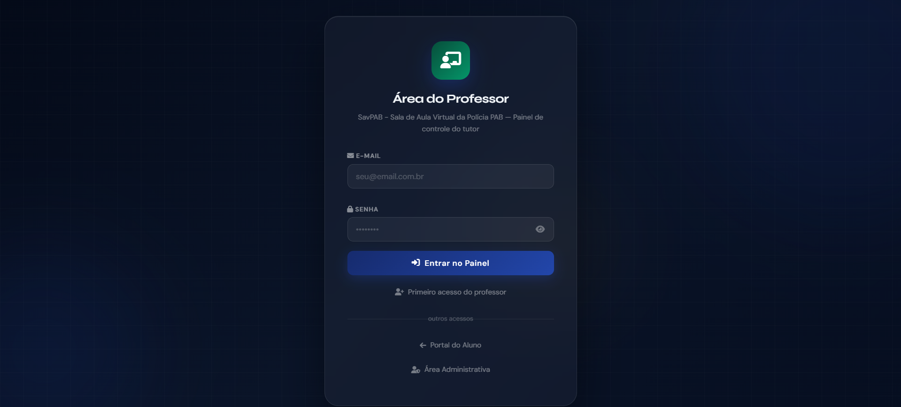

<h1 align="center">👋 Olá, eu sou o Matheus Rodrigues</h1>

<h3 align="center">
  Desenvolvedor Web & Full Stack | Fundador da Doacle - Soluções e Sistemas
</h3>

  Transformo ideias em interfaces modernas, sistemas sob medida e produtos digitais que resolvem problemas reais.

  
  
  
  
  

  

---

## 🚀 Sobre mim

Sou estudante de **Engenharia da Computação na UEFS** e desenvolvedor com **mais de 5 anos de experiência em desenvolvimento web**, atuando na criação de interfaces modernas, responsivas e sistemas completos para uso real.

À frente da **Doacle - Soluções e Sistemas**, desenvolvo sites, sistemas web, SaaS, automações, integrações com APIs e plataformas sob medida para empresas, comunidades e operações que precisam de tecnologia eficiente.

- 🎓 Estudante de **Engenharia da Computação** na **UEFS**
- 💻 Mais de **5 anos de experiência** em desenvolvimento web
- 🧠 Foco em **Front-end**, **Full Stack**, **SaaS**, **automações** e **integrações**
- 🏢 Fundador da **Doacle - Soluções e Sistemas**
- 🧩 Experiência com **HTML, CSS, JavaScript, React, Java, Python, PHP, Node.js e APIs**
- 🏅 Certificado pelo **Santander Tech+**, em parceria com a **Ada Tech**, nas trilhas de Back-End, JavaScript, React e Front-end
- 🎯 Busco evoluir constantemente e contribuir com soluções bem estruturadas, eficientes e focadas na experiência do usuário

---

## 🏢 Doacle - Soluções e Sistemas

A **Doacle** é minha empresa de desenvolvimento web, sistemas e softwares. Criamos soluções digitais para empresas médias e grandes, com foco em performance, experiência de uso, automação de processos e crescimento operacional.

Atuamos com:

- Sites institucionais e landing pages profissionais
- Sistemas web e ERPs sob medida
- SaaS e produtos digitais
- Dashboards administrativos
- Automações comerciais e operacionais
- Integrações com APIs
- Plataformas com autenticação, permissões, relatórios e fluxos personalizados

> Software bom não é só o que tem muitas features. É o que resolve o problema certo, com clareza, estabilidade e impacto real.

---

## ⭐ Projetos em destaque

### 🟧 Amplya

**SaaS de automação de atendimento, vendas e suporte no WhatsApp**, desenvolvido e distribuído pela **Doacle**.

A Amplya ajuda negócios a atender melhor, vender com mais contexto e organizar o relacionamento com clientes em conversas digitais. Hoje funciona com foco no WhatsApp e, em breve, será expandida para outros meios de comunicação.

**Principais recursos:**

- Automação de atendimento no WhatsApp
- Catálogo inteligente para vendas
- Configuração de IA comercial
- Perfil do negócio e personalização do assistente
- Suporte, vendas e operação em um único painel

  
  

  
  

---

### 🩸 Taurus RH

Sistema web de **gestão de pessoas e recursos humanos**, desenvolvido para centralizar rotinas de RH, DP e relatórios gerenciais em uma plataforma própria.

**Funcionalidades trabalhadas:**

- Gestão de funcionários
- Recrutamento, admissão e desligamentos
- Escalas, férias e ocorrências
- Relatórios e painéis administrativos
- Controle por perfis de usuário

  
  

---

### 🎓 SAVPAB

Sala de aula virtual desenvolvida para uma **comunidade RPG**, com estrutura completa para professores, alunos e administradores.

Tudo acontece dentro da plataforma: **aulas, provas, questões, correções, relatórios e notas**.

**Recursos do projeto:**

- Área do professor
- Gerenciamento de provas
- Banco de questões
- Correções e notas
- Relatórios de desempenho
- Painel administrativo

  
  

  

---

## 🧑‍💻 Minha stack

  

**Também trabalho com:**

- Desenvolvimento responsivo
- UI/UX para produtos digitais
- Consumo e criação de APIs
- Autenticação e permissões
- Dashboards administrativos
- Modelagem de sistemas
- Automação de processos

---

## 🤝 Vamos construir algo?

Se você precisa de um **site profissional**, **sistema sob medida**, **SaaS**, **automação**, **dashboard** ou uma solução digital para sua empresa, a Doacle pode ajudar.

  
  

---

  <strong>Programar é resolver problemas, gerar valor e transformar ideias em produtos reais.</strong>

